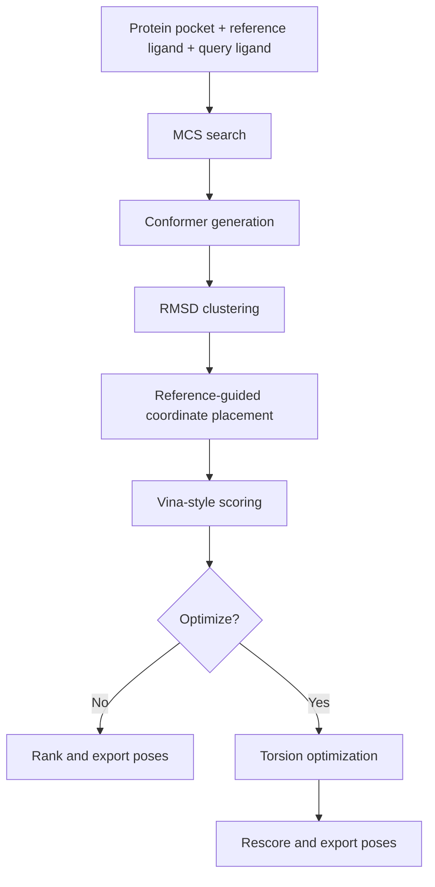
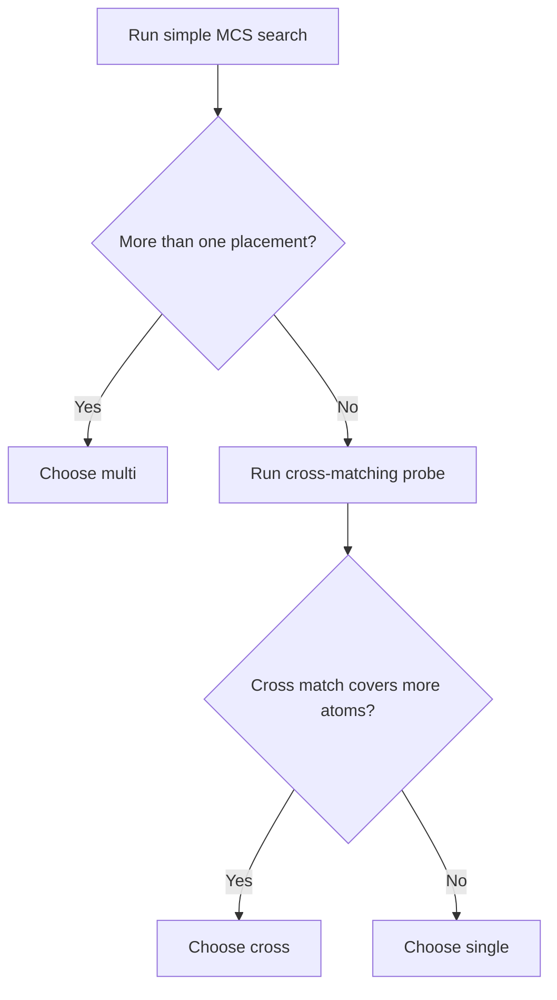

# Architecture

## Pipeline Summary

## MCS Decision Rule

The current default is `mcs_mode=auto`.

Interpretation:

- `multi` is selected when the same largest simple MCS lands in multiple symmetry-equivalent reference positions
- `cross` is selected only when multi-fragment matching increases the total anchor size beyond the best simple MCS
- otherwise the pipeline stays conservative and uses `single`

## End-To-End Inputs

Required inputs:

- protein pocket PDB
- reference ligand SDF
- query ligand as SMILES or SDF

Primary entry points:

- `scripts/run_pipeline.py`
- `lig_align.run_pipeline()`

## Stage Details

### 1. MCS Search

Purpose:

- find atom-to-atom anchors between the reference ligand and the query ligand
- define the rigid correspondence used by downstream placement and refinement

Main options:

- `mcs_mode`: `auto` | `single` | `multi` | `cross`
- `min_fragment_size`: integer, used in `cross` mode
- `max_fragments`: integer, used in `cross` mode

Behavior by option:

- `auto`
  - current default
  - picks `multi` if the same largest MCS has multiple placements in the reference
  - otherwise compares simple MCS against cross-matching and picks `cross` only if it increases total mapped atoms
  - otherwise falls back to `single`
- `single`
  - explicit conservative mode
  - finds one best mapping
  - best when the reference and query share a clear dominant common scaffold
- `multi`
  - finds multiple placements for symmetric references
  - current pipeline reports all candidate positions but uses the first mapping for continuation
  - useful when the same motif can land in more than one symmetry-equivalent place
- `cross`
  - allows multiple fragments and cross-combinations between reference and query
  - intended for more complex or fragmented common substructure cases
  - current pipeline reports all combinations but uses the first generated combination for continuation

Practical guidance:

- use `auto` for most routine runs
- use `single` when you explicitly want the fastest, most conservative contiguous-core behavior
- use `multi` when the reference has symmetry and multiple placements are chemically plausible
- use `cross` only when a single contiguous MCS is too restrictive

Outputs from this stage:

- selected `mapping` list of `(ref_atom_idx, query_atom_idx)` pairs
- MCS coverage statistics written onto the output molecule metadata

### 2. Constraint Extraction

Purpose:

- copy exact reference coordinates for the mapped query atoms
- build the coordinate constraints used during conformer generation and later placement

Internal outputs:

- `coordMap` for RDKit conformer generation
- per-run metadata such as MCS size and heavy-atom coverage

There are no public user-facing options here; this stage is driven by the result of Stage 1.

### 3. Conformer Generation

Purpose:

- build an ensemble of 3D query conformers before scoring
- bias the ensemble toward the reference core through the MCS coordinate map

Main options:

- `num_confs`: number of conformers to generate, default `1000`
- `rmsd_threshold`: RMSD threshold for diversity filtering and clustering, default `1.0`

Behavior:

- RDKit generates query conformers with the MCS coordinate map as an initial geometric hint
- larger `num_confs` improves coverage but costs more time
- smaller `rmsd_threshold` keeps more diverse representatives
- larger `rmsd_threshold` compresses the ensemble more aggressively

Practical guidance:

- `num_confs=1000`, `rmsd_threshold=1.0` is the current default and reasonable baseline
- increase `num_confs` for flexible molecules or when best-pose quality is unstable
- increase `rmsd_threshold` when too many near-duplicate representatives are being kept

Outputs from this stage:

- conformer ensemble stored in the query molecule
- representative conformer IDs selected for downstream processing

### 4. RMSD Clustering

Purpose:

- reduce the conformer ensemble to a smaller representative set before expensive scoring and optimization

Main option:

- `rmsd_threshold`

Behavior:

- clustering is driven by raw conformational diversity rather than a full all-pairs aligned RMSD workflow
- this keeps the screening stage tractable while preserving representative geometry classes

Tradeoff:

- lower threshold -> more representatives, higher cost, potentially better coverage
- higher threshold -> fewer representatives, lower cost, potentially more aggressive pruning

### 5. Reference-Guided Coordinate Placement

Purpose:

- force the chosen MCS atoms onto the reference coordinates
- optionally relax the non-MCS region to remove severe local strain

Main option:

- `mmff_optimize` in Python API
- `--no_mmff` in CLI to disable relaxation

Behavior:

- mapped query atoms are placed exactly onto reference coordinates
- if relaxation is enabled, the pipeline attempts MMFF first and falls back to UFF when MMFF construction or minimization is unstable
- if all query atoms are already fixed by the MCS, relaxation is skipped because there is nothing meaningful to move
- the result is written back into SDF metadata through `LigAlign_MMFF_Requested`, `LigAlign_MMFF_Optimized`, and `LigAlign_Relaxation_Summary`

Practical guidance:

- keep relaxation enabled for most runs
- disable relaxation only when you want to inspect the raw anchor-transfer effect or debug placement issues
- if `LigAlign_Relaxation_Summary` says the pose was skipped, that usually means the MCS already covered the entire query heavy-atom graph

Outputs from this stage:

- tensor of aligned coordinates for each representative conformer
- relaxation metadata describing whether MMFF or UFF actually ran

### 6. Vina-Style Scoring

Purpose:

- evaluate all representative poses against the protein pocket with differentiable scoring terms

Main options:

- `weight_preset`: `vina` | `vina_lp` | `vinardo`
- `torsion_penalty`: boolean

Behavior by option:

- `vina`
  - default preset
  - general-purpose baseline
- `vina_lp`
  - local-preference variant
  - useful when comparing preset sensitivity
- `vinardo`
  - alternative scoring preset
  - often worth trying when ranking behavior under standard Vina is unsatisfactory
- `torsion_penalty=True`
  - default behavior for `vina`-style reporting in this project
  - adds torsional entropy penalty based on rotatable bond count
  - mostly affects cross-ligand score comparison rather than same-ligand pose ordering

Practical guidance:

- start with `vina`
- compare against `vinardo` when ranking quality is questionable
- keep torsion penalty enabled unless you explicitly want interaction-only scores

Outputs from this stage:

- per-pose score tensor
- best-pose ranking prior to optional optimization

### 7. Torsion Optimization

Purpose:

- refine poses through gradient-based torsion updates rather than relying only on initial conformer placement

Main options:

- `optimize`: enable or disable this stage
- `optimizer`: `adam` | `adamw` | `lbfgs`
- `opt_steps`: optimization steps, default `100`
- `opt_lr`: learning rate, default `0.05`
- `opt_batch_size`: poses optimized together, default `128`
- `freeze_mcs`: boolean, default `True`
- CLI inverse flag: `--free_mcs`

Behavior by option:

- `optimize=False`
  - pipeline skips refinement and directly ranks the initial aligned poses
- `optimizer=adam`
  - default choice
  - good speed and robust convergence for routine use
- `optimizer=adamw`
  - similar behavior with weight decay style regularization
  - useful when experimenting with stability on harder cases
- `optimizer=lbfgs`
  - slower but often stronger for final refinement
  - better suited to smaller pose batches or higher-accuracy runs
- `freeze_mcs=True`
  - keeps anchor atoms rigid during optimization
  - preserves the reference-driven alignment hypothesis
- `freeze_mcs=False`
  - allows the MCS itself to move
  - useful for exploratory refinement, but weaker as a strict anchor-based workflow

Batching behavior:

- optimization is performed across representative poses in batches
- `opt_batch_size` should be reduced if GPU memory becomes limiting or if a query leaves unusually many representative poses
- larger batches improve throughput when memory permits

Practical guidance:

- enable optimization for serious ranking runs
- use `adam` first, then compare `lbfgs` for quality-focused experiments
- keep `freeze_mcs=True` unless you explicitly want to relax the alignment anchor

Outputs from this stage:

- optimized coordinates
- rescored pose energies
- score deltas relative to the initial scoring pass
- SDF metadata including `Vina_Score_Initial`, `Vina_Score_Final`, and `Vina_Score_Delta`

### 8. Selection And Export

Purpose:

- write the final ranked poses to SDF and store run metadata

Main options:

- `save_all_poses`: optional override in Python API
- `top_k`: optional override in Python API
- `output_dir` / `out_dir`: destination path

Default behavior:

- if `optimize=False`, save top 3 poses
- if `optimize=True`, save all optimized representative poses

Output files:

- non-optimized run: `predicted_pose_top3.sdf`
- optimized run: `predicted_poses_all.sdf`

Metadata written to outputs includes:

- MCS coverage
- requested and actual MCS mode
- number of generated conformers
- whether relaxation was requested and actually applied
- relaxation summary
- whether gradient optimization was used
- initial/final score and score delta

## Option Summary

| Area | Options |
|---|---|
| MCS | `mcs_mode`, `min_fragment_size`, `max_fragments` |
| Conformer generation | `num_confs`, `rmsd_threshold` |
| Placement | `mmff_optimize` / `--no_mmff` |
| Scoring | `weight_preset`, `torsion_penalty` |
| Optimization | `optimize`, `optimizer`, `opt_steps`, `opt_lr`, `opt_batch_size`, `freeze_mcs` / `--free_mcs` |
| Output | `output_dir`, `save_all_poses`, `top_k` |
| System | `device`, `verbose` |

## Implementation Notes

- Batched operations matter more than single-pose peak quality for throughput
- MCS anchoring is the central design constraint of the current system
- `multi` and `cross` currently enumerate multiple mappings but continue with the first candidate
- scoring and optimization share the same feature representation and energy family, which keeps refinement behavior consistent with ranking
