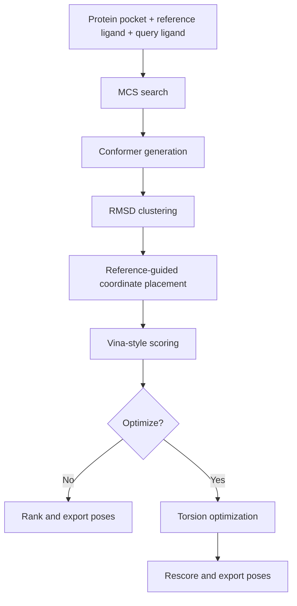

# Architecture

## Pipeline Summary

## Stage Details

### 1. MCS Search

- Finds atom mappings between reference and query
- Supports `single`, `multi`, and `cross` matching modes
- Provides the anchor needed for downstream placement and optimization

### 2. Conformer Generation And Clustering

- Generates a query conformer ensemble
- Computes RMSD-based diversity without expensive all-pairs Kabsch alignment
- Selects representative conformers before scoring and refinement

### 3. Reference-Guided Placement

- Places mapped atoms onto the reference geometry
- Optionally relaxes the full structure with MMFF while preserving anchors
- Produces physically cleaner starting poses than raw coordinate transfer alone

### 4. Differentiable Scoring

- Computes Vina-like interaction terms in PyTorch
- Supports `vina`, `vina_lp`, and `vinardo` presets
- Enables both fast scoring and gradient-based optimization

### 5. Torsion Optimization

- Builds a rotatable-bond kinematic tree
- Updates torsion angles through backpropagation
- Optimizes representative poses in batches on GPU
- Can freeze or release MCS atoms depending on the experiment

## Implementation Notes

- Batched operations matter more than single-pose peak quality for throughput
- MCS anchoring is the central design constraint of the current system
