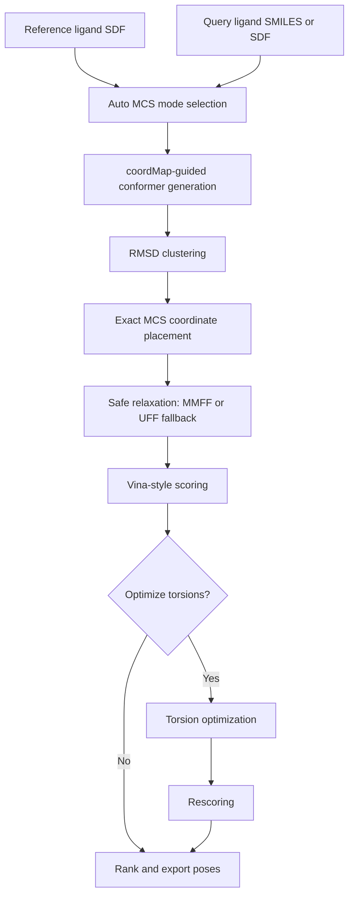

# Weekly Report: 2026-03-06

## Summary

This week focused on turning LigAlign from a local prototype into a shareable and explainable repository. The pipeline itself was tightened around MCS-guided alignment, `auto` MCS mode selection was added, force-field relaxation was stabilized, and the repository was reorganized so that README, architecture notes, reports, and example assets are now presentation-ready.

## What Was Completed

- initialized and published the repository to GitHub
- simplified the top-level README and moved detailed material into `docs/`
- created `reports/` and standardized weekly reporting structure
- added `mcs_mode=auto` with explicit decision logic for `single`, `multi`, and `cross`
- removed pharmacophore-related code and documents to keep the scope aligned with the actual method
- stabilized post-placement relaxation with MMFF guards and UFF fallback
- added output metadata for MCS mode, relaxation outcome, and score deltas
- ensured example structure files and visualization assets are visible on GitHub under `examples/10gs`

## Current Narrative

LigAlign currently follows a clear anchor-based workflow:

1. identify the best usable MCS anchor between reference and query
2. generate query conformers with the chosen MCS geometry used as a placement hint
3. cluster the conformers and keep representative poses
4. overwrite the mapped atoms onto the reference coordinates exactly
5. apply safe local relaxation only when movable atoms remain
6. score poses with differentiable Vina-style terms
7. optionally refine torsions and rescore the results
8. export ranked poses together with run metadata

This keeps the method easy to explain in meetings: the system is not a generic black-box docking loop, but a reference-guided pose construction pipeline with explicit anchors.

Useful links:

- [Open the full pipeline diagram](../docs/ARCHITECTURE.md#pipeline-summary)
- [Open the MCS decision rule](../docs/ARCHITECTURE.md#mcs-decision-rule)

## Visual Evidence

### Representative Run

### Reference-Guided Run

### Torsion Penalty Comparison

Penalty off:

Penalty on:

### MCS Constraint Comparison

Fixed MCS:

Free MCS:

### Scoring Preset Snapshots

Vina preset:

Vinardo preset:

### Combinatorial Example

Representative variant:

## Concept Diagram

## Technical Highlights

### 1. Automatic MCS Mode Selection

The default MCS mode is now `auto`.

Decision rule:

- choose `multi` when the same largest simple MCS appears in multiple symmetry-equivalent positions
- choose `cross` only when multi-fragment cross-matching increases the total anchor size
- otherwise fall back to `single`

This gives the pipeline a better default behavior without forcing users to understand edge-case MCS settings before the first run.

### 2. Safer Relaxation After Exact Placement

The relaxation stage was one of the main sources of avoidable failure. It now behaves more defensibly.

Current behavior:

- skip relaxation if all query atoms are fixed by the selected MCS
- skip relaxation when too few atoms remain movable
- attempt MMFF first
- fall back to UFF if MMFF construction or minimization is unstable
- record the result in the exported SDF

Relevant output fields:

- `LigAlign_MMFF_Requested`
- `LigAlign_MMFF_Optimized`
- `LigAlign_Relaxation_Summary`

### 3. More Useful Output Metadata

Exported SDF files now carry both method and score context.

Examples:

- `LigAlign_MCS_Mode`
- `LigAlign_MCS_Mode_Requested`
- `Vina_Score_Initial`
- `Vina_Score_Final`
- `Vina_Score_Delta`

This makes it easier to inspect whether optimization actually changed the ranking and whether `auto` mode selected the expected MCS strategy.

## Validation Notes

Smoke checks performed during this update cycle:

- `auto` mode was confirmed to select `multi` for a small symmetric-match example
- end-to-end CLI runs completed successfully with `--mcs_mode auto`
- optimized and non-optimized runs both exported the new score metadata fields
- GitHub contents were checked to confirm that example structure files are now visible under `examples/10gs`

Representative observation from the smoke run:

- when the MCS covered the entire small query molecule, relaxation was correctly skipped and reported rather than failing inside RDKit line search

## Repository Status

The repository is now organized around three clear entry surfaces:

- [README.md](../README.md): short project overview and first run path
- [docs/ARCHITECTURE.md](../docs/ARCHITECTURE.md): detailed method explanation and option behavior
- [reports/README.md](README.md): meeting-oriented reporting index and templates

The example set is now complete on GitHub:

- `examples/10gs/10gs_pocket.pdb`
- `examples/10gs/10gs_ligand.sdf`
- `examples/10gs/visualizations/`

## Risks And Gaps

- `multi` and `cross` still enumerate multiple candidates but continue with the first candidate only
- current smoke validation was focused on small examples and metadata correctness, not broad benchmark quality
- relaxation fallback exists, but there is still no systematic benchmark comparing MMFF, UFF fallback, and no-relaxation behavior across a larger ligand set
- package metadata is improved, but licensing and benchmark reporting are still incomplete

## Next Actions

- implement evaluation of more than the first `multi` or `cross` MCS candidate
- add benchmark-oriented reports with runtime, representative count, and score-delta tables
- define a compact “meeting-safe” subset of GIF assets for repeated slide use
- add a short section describing known limitations and current defaults for `auto`, `multi`, and `cross`
