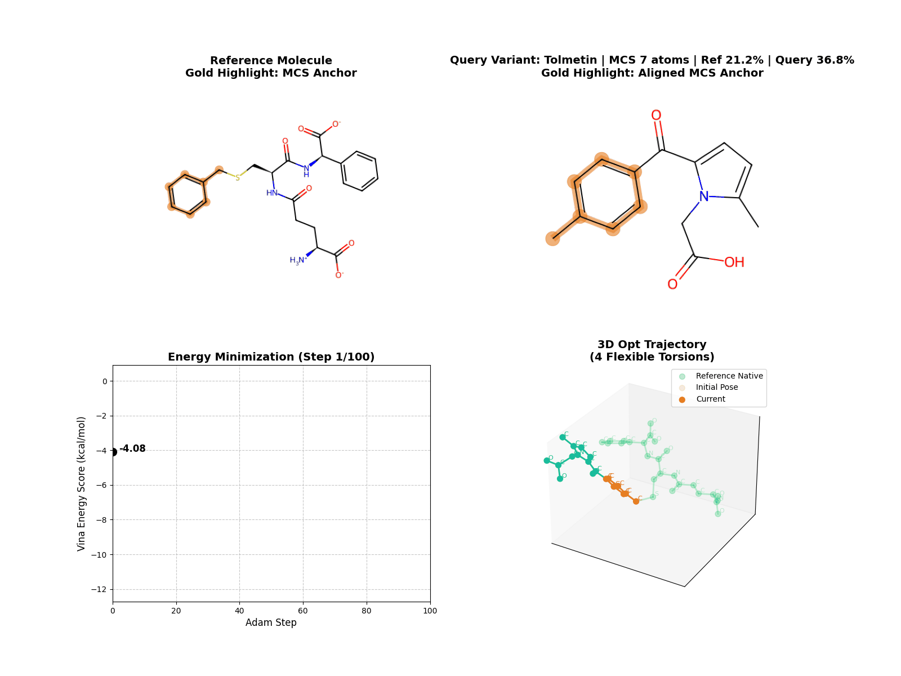
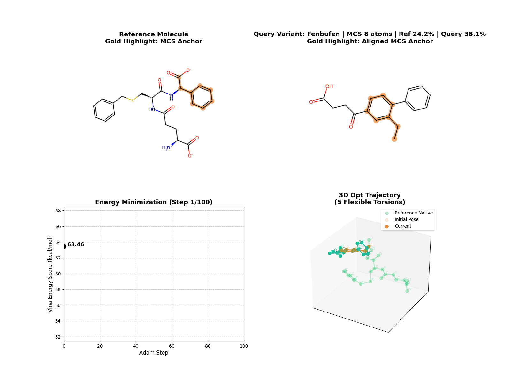
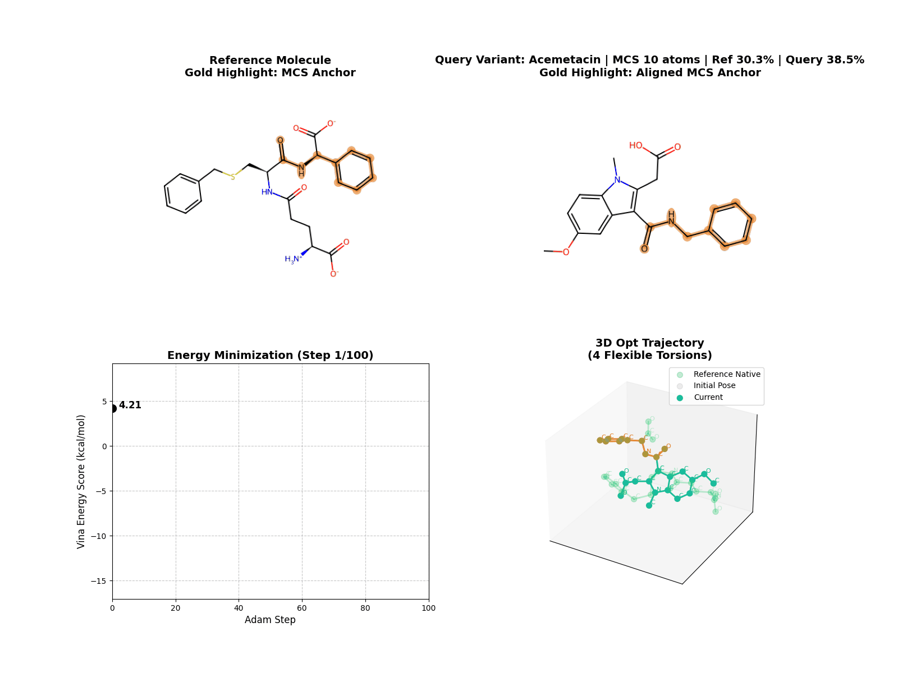

# Weekly Report: 2026-03-06

## Executive Summary

This week moved LigAlign from a loosely organized prototype into a shareable repository with a clearer default behavior and more robust runtime handling.

The three most important outcomes were:

- the repository was cleaned up for external use, with examples, docs, and reports separated into clearer entry points
- `mcs_mode=auto` was added so the pipeline can choose between `single`, `multi`, and `cross` more sensibly by default
- post-placement relaxation and output metadata were hardened so runs fail less often and exported SDF files explain what happened

Current status:

- the main MCS-guided pipeline is working and published on GitHub
- example input structures and visualization GIFs are visible in the repository
- weekly reporting now has a reusable template and a cleaner link path to the architecture document

Primary follow-up:

- the pipeline still enumerates `multi` and `cross` candidates but continues with only the first candidate

## Scope Of This Week

This reporting cycle covered four areas:

- repository cleanup and publication
- MCS behavior and default selection strategy
- relaxation and scoring robustness
- report and documentation structure

## What Changed

### 1. Repository Cleanup And Publication

Problem:

- the repository had become difficult to scan because README, technical notes, and meeting material were mixed together
- example structure files were not visible on GitHub even though GIF outputs were present

Action:

- simplified the top-level README
- moved detailed material into `docs/`
- created `reports/` as a dedicated meeting/reporting space
- updated `.gitignore` so example `PDB` and `SDF` files under `examples/` are tracked
- normalized file permissions for example assets

Result:

- the repository is now readable from GitHub without local context
- `examples/10gs/10gs_pocket.pdb` and `examples/10gs/10gs_ligand.sdf` are visible online
- top-level navigation is clearer: overview in `README.md`, method details in `docs/`, weekly material in `reports/`

### 2. Automatic MCS Mode Selection

Problem:

- users had to choose `single`, `multi`, or `cross` manually even when the decision could often be inferred from the molecules
- this made the first run path harder than necessary and increased the chance of using the wrong mode by default

Action:

- added `mcs_mode=auto` as the default in both CLI and Python API
- implemented a decision rule:
  - choose `multi` when the same largest simple MCS appears in multiple placements
  - choose `cross` only when cross-matching increases total mapped atoms beyond the best simple MCS
  - otherwise choose `single`
- recorded both the requested mode and the actual chosen mode in output metadata

Result:

- the pipeline now behaves more sensibly out of the box for common cases
- users can still force `single`, `multi`, or `cross`, but no longer need to do so for routine runs
- the selection is traceable in exported SDF files through:
  - `LigAlign_MCS_Mode`
  - `LigAlign_MCS_Mode_Requested`

### 3. Relaxation And Score Metadata Stabilization

Problem:

- exact MCS placement could hand invalid or trivial cases to MMFF relaxation
- in small molecules where the MCS covered the full query, MMFF minimization could fail inside RDKit line search
- exported SDF files did not clearly distinguish pre-optimization and post-optimization scores

Action:

- added logic to skip relaxation when no meaningful movable atoms remain
- added a safer force-field relaxation helper
- attempted MMFF first and added UFF fallback when MMFF is unstable
- recorded whether relaxation was requested and whether it actually ran
- added explicit initial/final/delta score fields in SDF outputs

Result:

- the pipeline no longer treats “all atoms fixed” cases as MMFF failures
- small-molecule smoke tests completed successfully instead of dying in line search
- SDF files now expose:
  - `LigAlign_MMFF_Requested`
  - `LigAlign_MMFF_Optimized`
  - `LigAlign_Relaxation_Summary`
  - `Vina_Score_Initial`
  - `Vina_Score_Final`
  - `Vina_Score_Delta`

### 4. Documentation And Reporting Structure

Problem:

- architecture details, operational usage, and meeting material were not separated cleanly
- the previous weekly report mixed visual material and architecture explanation too tightly

Action:

- expanded `docs/ARCHITECTURE.md` with stage-by-stage options and an `auto` MCS decision tree
- improved `docs/USAGE.md` to explain output metadata and current mode limitations
- added `reports/weekly-template.md`
- removed the redundant concept diagram from the weekly report and linked directly to the architecture doc instead

Result:

- the weekly report now stays focused on engineering progress, results, and next actions
- the architecture note is the canonical place for method flow and decision logic
- reporting is more repeatable week to week

## Validation

| Area | Check | Expected | Observed |
|---|---|---|---|
| Auto MCS | `--mcs_mode auto` on a small symmetric-match example | `auto` resolves to `multi` | confirmed in runtime log and output metadata |
| End-to-end run | CLI run with `auto` mode | pipeline completes successfully | confirmed |
| Relaxation guard | query fully covered by MCS | relaxation is skipped safely | confirmed via `LigAlign_Relaxation_Summary` |
| Score metadata | optimized and non-optimized exports | SDF includes initial/final/delta score fields | confirmed |
| GitHub examples | inspect `examples/10gs` on GitHub | `pdb`, `sdf`, and visualizations visible | confirmed |

Representative observed behavior:

- for a small query where the MCS covered the full query heavy-atom graph, the pipeline reported relaxation as skipped rather than crashing in RDKit MMFF minimization

## Key Visuals

### Representative Run

Why it matters:

- useful as the main “this is the pipeline in motion” asset for slides and review

### Reference-Guided Run

Why it matters:

- best quick visual for explaining the anchor-guided nature of the method

### MCS Constraint Comparison

Fixed MCS:

Free MCS:

Why it matters:

- shows the practical difference between keeping the MCS rigid and allowing it to move during optimization

### MCS Coverage Gallery

All three GIFs below were rendered with the same `100` optimization steps so the visual comparison is less confounded by run length.

Low coverage:

Medium coverage:

High coverage:

Why it matters:

- this makes MCS coverage differences easier to compare under a consistent `100`-step optimization budget
- it reduces the visual inconsistency that came from mixing assets generated with different settings

Additional reference assets:

- [Full pipeline diagram](../docs/ARCHITECTURE.md#pipeline-summary)
- [MCS decision rule](../docs/ARCHITECTURE.md#mcs-decision-rule)
- [Full architecture note](../docs/ARCHITECTURE.md)
- `examples/10gs/visualizations/coverage/`
- `examples/10gs/visualizations/torsion_penalty_on.gif`
- `examples/10gs/visualizations/torsion_penalty_off.gif`
- `examples/10gs/visualizations/preset_vina_basic.gif`
- `examples/10gs/visualizations/preset_vinardo_basic.gif`
- `examples/10gs/visualizations/combinatorial/`

## What Improved

The repository is better than it was at the start of the week in three concrete ways.

- easier to understand
  - README, docs, reports, and examples now have clearer roles
- safer to run
  - edge-case relaxation behavior is guarded and explained in metadata
- easier to inspect
  - exported SDF files now carry enough context to understand what the pipeline actually did

## What Still Needs Work

### 1. Multi-Candidate MCS Evaluation Is Still Limited

Current state:

- `multi` and `cross` enumerate multiple possibilities
- the pipeline still continues with only the first candidate

Why this matters:

- good alternative mappings can still be missed even though the enumeration logic already exists

### 2. Validation Is Still Smoke-Test Level

Current state:

- current validation confirms behavior and metadata correctness
- it does not yet provide a benchmark-style view of runtime, score quality, or robustness across a ligand set

Why this matters:

- the method is easier to trust qualitatively than quantitatively right now

### 3. Relaxation Fallback Exists But Is Not Benchmarked

Current state:

- MMFF skip/fallback behavior is implemented
- there is not yet a systematic comparison of MMFF vs UFF fallback vs no relaxation

Why this matters:

- the stability problem is better handled, but the quality tradeoff is not yet measured

### 4. Packaging Is Cleaner, But Not Finished

Current state:

- project description and example assets are improved
- license and broader distribution polish are still incomplete

## Recommended Next Steps

### P1. Evaluate More Than The First MCS Candidate

- use the existing `multi` and `cross` enumeration more fully
- start with a top-N candidate evaluation path rather than full exhaustive optimization of everything

### P2. Add Benchmark-Oriented Reporting

- create a weekly table with:
  - runtime
  - number of conformers
  - number of representatives
  - initial score
  - final score
  - score delta

### P3. Define A Small “Meeting-Safe” Asset Set

- keep 3 to 5 canonical GIFs for repeated use in updates and slides
- avoid making each report visually noisy with too many equally weighted animations

### P4. Document Current Known Limits More Explicitly

- call out that `multi` and `cross` currently enumerate but do not fully branch through all candidates
- note the intended future direction in both `README.md` and `docs/ARCHITECTURE.md`
