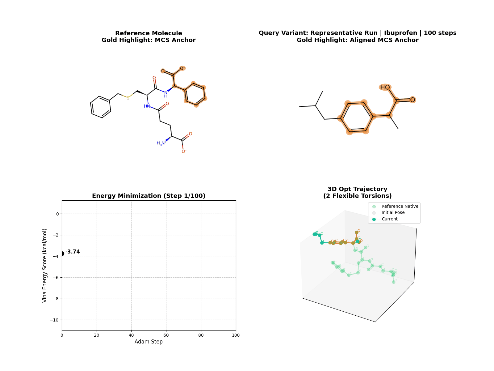
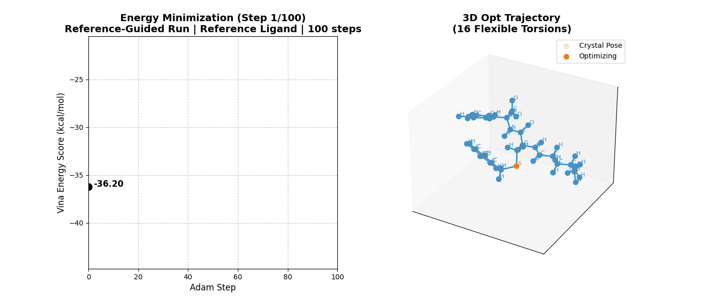
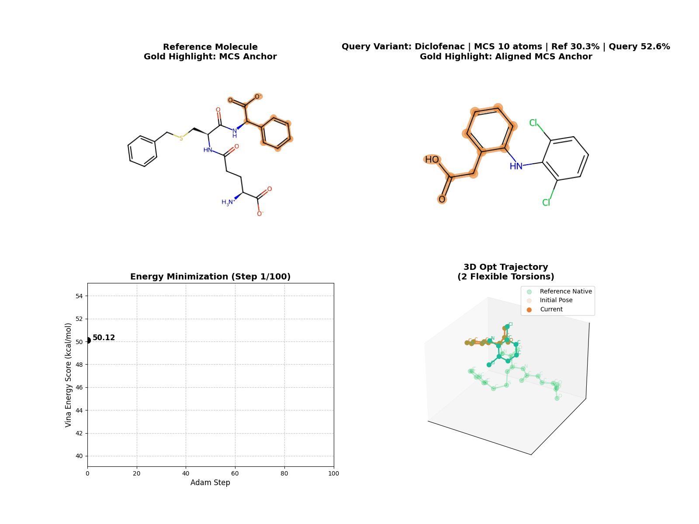
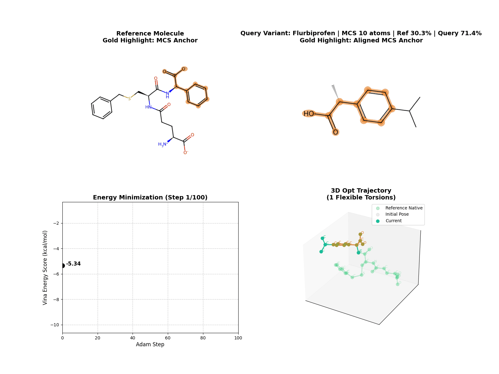

# Progress

## Summary

This report focuses on what the current LigAlign pipeline does, what kinds of reference-guided behavior it can show, and what the latest visualization set demonstrates.

Core idea:

- use the MCS between a reference ligand and a query ligand as an anchor
- generate query conformers around that anchor
- optimize torsions under pocket-based scoring
- compare how the result changes as MCS overlap changes

Architecture reference:

- [Full pipeline diagram](../docs/ARCHITECTURE.md#pipeline-summary)
- [MCS decision rule](../docs/ARCHITECTURE.md#mcs-decision-rule)
- [Full architecture note](../docs/ARCHITECTURE.md)

## How It Works

Current pipeline flow:

1. find an MCS between reference and query
2. use the reference MCS coordinates as an anchor for query conformer generation
3. cluster generated conformers and keep representatives
4. place the query onto the reference anchor
5. apply constrained relaxation
6. optimize torsions against the pocket score
7. export poses and score metadata

Current runtime behavior:

- `mcs_mode=auto` chooses between `single`, `multi`, and `cross`
- relaxation safely skips trivial fixed-core cases
- output SDFs record selected mode, relaxation status, and score deltas
- current batched optimization supports multiple poses of the same molecule, not mixed-molecule batches

## What This Setup Can Show

The current asset set is useful for four questions:

1. What does a representative optimization trajectory look like?
2. What changes when the run is explicitly reference-guided?
3. What changes when the MCS core is fixed vs free during optimization?
4. How does behavior change as overlap increases from the query side and from the reference side?

## Main Results

### Runtime And Batch Behavior

Measured on `CPU` with the current `10gs` example pocket and `100` optimization steps.

Stage-level timing:

| Molecule | Heavy atoms | Torsions | MCS atoms | Conformer + clustering | Relax | Query feature | Pocket feature | Optimization (100 steps) |
|---|---:|---:|---:|---:|---:|---:|---:|---:|
| Flurbiprofen | 14 | 1 | 10 | 0.301 s | 0.002 s | 0.002 s | 1.758 s | 0.380 s |
| Diclofenac | 19 | 2 | 10 | 0.310 s | 0.002 s | 0.003 s | 1.758 s | 0.496 s |
| Acemetacin | 26 | 4 | 10 | 0.700 s | 0.006 s | 0.004 s | 1.758 s | 0.264 s |
| Cyclohexylmethyl analog | 32 | 1 | 26 | 1.355 s | 0.003 s | 0.006 s | 1.758 s | 0.365 s |

Interpretation:

- `MCS` and constrained relaxation are cheap in the current setup
- the largest fixed cost is pocket feature construction at about `1.76 s` per run
- conformer generation and clustering grows the most with molecule size and flexibility
- optimization cost scales with `step` count, but not monotonically with heavy-atom count alone
- this makes pocket feature caching the most obvious first optimization for repeated runs on the same receptor
- a same-process smoke test showed `10gs` pocket loading dropping from about `2.01 s` on first load to effectively `0 s` on cache hit

Batch and early-stopping probe:

`Acemetacin` was benchmarked over `5` seeds with `300` optimization steps. The representative-pose count varied by seed from `1` to `29`, with a mean of `20.8`.

| Batch size | Early stopping | Total time mean | Total time std | Avg steps mean | Avg steps std | Representative poses mean | Time per pose |
|---|---:|---:|---:|---:|---:|---:|---:|
| 1 | off | 23.214 s | 12.923 s | 300.0 | 0.0 | 20.8 | 1116.05 ms |
| 1 | on | 9.992 s | 4.593 s | 164.4 | 2.9 | 20.8 | 480.40 ms |
| 4 | off | 18.447 s | 8.581 s | 300.0 | 0.0 | 20.8 | 886.89 ms |
| 4 | on | 9.972 s | 4.581 s | 164.4 | 2.9 | 20.8 | 479.43 ms |
| 8 | off | 18.235 s | 8.413 s | 300.0 | 0.0 | 20.8 | 876.67 ms |
| 8 | on | 9.957 s | 4.574 s | 164.4 | 2.9 | 20.8 | 478.69 ms |

Interpretation:

- with a longer `300`-step budget, early stopping reduced the average step count from `300` to about `164`
- that translated to roughly a `57%` reduction in total runtime in this probe
- increasing `batch_size` still did not materially reduce runtime in the current implementation
- the main reason is that the optimizer still iterates pose-by-pose inside each batch, so this is workflow batching rather than a fully vectorized batched optimizer
- heterogeneous batches with different molecules are not yet supported by the current API
- `VRAM` was not measured here because CUDA was not available in the current environment
- runtime variance across seeds is large because the representative-pose count changes substantially with seeded conformer generation

What this suggests:

- pocket feature caching is likely a higher-value speedup than changing `batch_size`
- if batch efficiency is a priority, the optimization loop should move toward true tensorized multi-pose execution
- early stopping is worth keeping, but it should always be evaluated together with pose-count variance across seeds

### Representative Optimization Run

Use:

- the default "what the method looks like in motion" asset

### Reference-Guided Run

Use:

- the clearest short visual for explaining the anchor-guided setup

### Fixed-Core vs Free-Core Optimization

Fixed MCS:

Free MCS:

Use:

- shows how strongly the anchor constraint affects the optimization path

### Query-Coverage View

All GIFs below were rendered with the same `100` optimization steps.

Lower query coverage:

- `Acemetacin`: query `38.5%`, ref `30.3%`, heavy atoms `26`

Mid query coverage:

- `Diclofenac`: query `52.6%`, ref `30.3%`, heavy atoms `19`

Higher query coverage:

- `Flurbiprofen`: query `71.4%`, ref `30.3%`, heavy atoms `14`

Interpretation:

- this view isolates how much of the query ligand is anchored by the shared scaffold

### Reference-Coverage View

This set uses `10gs`-derived analogs instead of unrelated external molecules.

Lower reference coverage:

- `Cyclohexyl-plus-Ala analog`: query `74.1%`, ref `60.6%`, heavy atoms `27`

Mid reference coverage:

- `Pyridyl-plus-cyclohexyl analog`: query `78.1%`, ref `75.8%`, heavy atoms `32`

Higher reference coverage:

- `Cyclohexylmethyl analog`: query `81.2%`, ref `78.8%`, heavy atoms `32`

Interpretation:

- this view isolates how much of the original reference scaffold is retained
- keeping this set below roughly `80%` ref coverage avoids turning the comparison into an almost-native replay

## What Looks Good Already

- the reference-guided behavior is visually clear
- fixed-core vs free-core comparison is easy to explain
- splitting coverage into query-side and reference-side views makes the overlap story much easier to read
- using `10gs`-derived analogs for the ref-focused set is more defensible than mixing in unrelated molecules

## What Should Improve Next

1. evaluate more than the first `multi` or `cross` MCS candidate
2. move the optimizer toward true tensorized multi-pose execution
3. reduce the final slide set to a small canonical asset pack for repeated meetings
